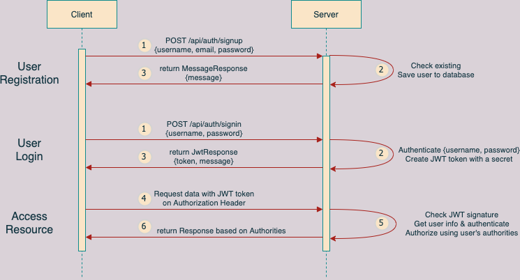

# Recipe API
* It is a Spring Boot application that runs CRUD operations for recipes.
* The data is persisted into MySQL database using Spring Data.
* Embedded database H2 is used for testing purposes.
* This application is secured with JWT authentication using Spring Security.
* Both MySQL and Spring Boot images are containerized therefore we can run the whole with a single command.
* API Endpoint Documentation is prepared using Open API.

## User Registration, User Login and Authorization process
This flow diagram shows the implementation of User Registration, User Login and Authorization process.



## Requirements

For building and running the application you may need followings:

- [JDK 8](https://www.oracle.com/java/technologies/downloads/#java8)
- [Maven 3](https://maven.apache.org/download.cgi)
- [MySQL 8](https://dev.mysql.com/downloads/mysql/)
- [Docker Desktop](https://www.docker.com/products/docker-desktop)

## How to build and run

### Using Docker

```shell
docker-compose up
```

In order to run the services on the background, please do so:

```shell
docker-compose up -d
```

In order to stop the running containers and remove the volumes, please do so:

```shell
docker-compose down -v
```

### Without Docker

In order to build, please do so:

```shell
mvn clean install
```

After successful build, please do so:

```shell
mvn spring-boot:run
```

Alternatively you can run jar from terminal like so:

```shell
java -jar target/recipe-backend-0.0.1-SNAPSHOT.jar
```

In order to test, please do so:

```shell
mvn test
```


## How to test manually

* POST request to `/api/auth/signup` endpoint with a valid username, email and password like below:

```shell
{
    "username":"user",
    "email":"user@user.com",
    "password":"password"
}
```

* POST request to `/api/auth/signin` endpoint with the same username and password like below:

```shell
{
    "username":"user",
    "password":"password"
}
```

* Any request to `/api/recipes/**` endpoints setting the Bearer token in the Authorization Header that returns from the `/api/auth/signin` endpoint.

## API Endpoint Documentation
- [Open API](http://localhost:8080/swagger-ui/index.html?configUrl=/v3/api-docs/swagger-config)